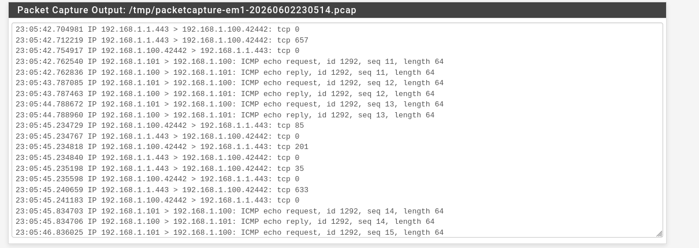

# pfSense Promiscuous Mode
This mode is used to sniff not between subnetworks, but in network. It wont be as effective as creating VLANS (subnets) but will catch everything that is going on inside this network.
*idk if it's true* it cannot stop movements from two seperate machines, as in vlan we can cut the communitacion. But is enough for a home lab

